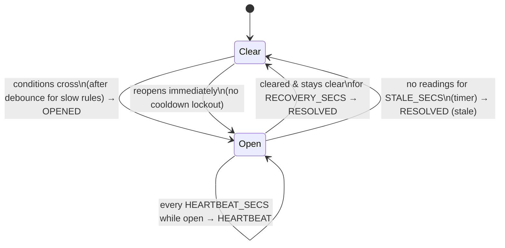

# Alerting logic

How an enriched reading becomes an **incident**. Today the rules are pure and
stateless — [`shared/rules.py`](../shared/rules.py) annotates each row and keeps the
ones that alert. This document specifies the **stateful** version: the same five
rules, but keyed per freezer and shaped as incidents with a lifecycle, so the live
cockpit shows *what is happening to a unit over time* rather than a firehose of
per-reading alerts.

It builds directly on the [data model](./data-model.md): the input is an
`enriched_schema()` row (a reading plus its per-unit thresholds and context).

## Why stateful

The stateless function fires **once per reading**. That is correct but noisy: a
single sensor spike pages someone, a defrost cycle looks like a failure, and a
freezer that has been bad for ten minutes emits a fresh identical alert on every
reading. Holding a little state per freezer lets us reject noise, understand
defrost, and speak in incidents — **OPENED / ESCALATED / RESOLVED** — the way an
operator actually thinks.

Crucially, this is *not* what makes RTM fast. RTM's sub-second edge comes from the
trigger, not the logic; the stateful logic is the same under RTM and micro-batch.
What state buys the demo is a console that looks like a real ops tool.

## Where it sits in the pipeline

```
Kafka freezer_sensor_events
        │  from_json → EVENT_SCHEMA
        ▼
  enrich (broadcast stream-static join on freezer_id)     ← no shuffle
        ▼
  transformWithState  keyed by freezer_id                 ← the ONE streaming shuffle
        ▼
  add_latency_fields (source_mode + timing)
        ▼
Kafka freezer_alerts_enriched   (only sink)
```

RTM constraints this respects:

- **One streaming shuffle per query.** Enrichment is a broadcast (no shuffle), so
  `transformWithState`'s keying by `freezer_id` is the single shuffle. Safe.
- **`handleInputRows` is called once per row** in RTM — the processor handles one
  reading at a time, so all logic is per-row plus stored state.
- **Processing-time timers only** (no event-time timers in RTM). Every *sustained
  window* is therefore computed from `event_ts` arithmetic held in state; a
  processing-time timer is used **only** for the heartbeat re-emit and for closing a
  stale incident when readings stop arriving.
- Slot math grows by the shuffle stage's partitions (Σ partitions across stages) —
  note in the deploy checklist.

## Per-freezer state

One state struct per `freezer_id`:

| group | fields | purpose |
|---|---|---|
| reading | `last_event_ts`, `last_temp` | deltas |
| smoothing | `temp_ewma` | reject a single noisy sample before it pages |
| trend | `temp_slope_c_per_min` | the "warming" signal, derived from the EWMA |
| debounce | `over_limit_since`, `consecutive_over`, `health_bad_since` | sustained windows for the slow rules |
| door | `door_open_since` | door timer |
| defrost | `defrost_until_ts` | suppress TEMP_HIGH during a defrost cycle + a grace period |
| incident | `open`, `incident_id`, `type`, `severity`, `started_ts`, `peak_temp`, `escalation_level`, `last_emit_ts` | lifecycle, dedup, heartbeat |
| trend buffer | ring of the last `TREND_SAMPLES` `(ts, temp)` pairs | the click-through sparkline |

## The five rules — fast vs. sustained

All five become stateful, split by how quickly they should fire. The **precedence**
is unchanged from `shared/rules.py`
(`MULTI_SIGNAL_CRITICAL > POWER_AND_WARMING > COMPRESSOR_FAILURE_RISK >
DOOR_OPEN_TOO_LONG > TEMP_HIGH`), and the per-reading classification reuses the same
predicates and constants (`DEGRADED_HEALTH=0.5`, `LOW_BATTERY_PCT=30.0`,
`NEAR_LIMIT_C=1.0`).

| rule | speed | trigger | why |
|---|---|---|---|
| **DOOR_OPEN_TOO_LONG** | **fast** | `door_open_seconds > door_open_limit_seconds` | the sensor's own counter is already a sustained measure — fire on first crossing |
| **POWER_AND_WARMING** | **fast** | `power_state ∈ {battery, outage}` + low battery + positive `temp_slope` | power state is discrete; pair it with any warming and page now |
| **MULTI_SIGNAL_CRITICAL** | **fast** | ≥2 concurrent signals on a high-value asset | escalate to `critical` immediately, no debounce |
| **COMPRESSOR_FAILURE_RISK** | sustained | `compressor_off` + `health < 0.5` + near limit, held `COMPRESSOR_WINDOW` | one low health reading isn't a failure |
| **TEMP_HIGH** | sustained | `temp_ewma > limit`, held `TEMP_WINDOW`, **and not inside a defrost window** | reject spikes and defrost cycles |

The split is the demo's second beat: the **fast** rules show RTM reacting in
sub-second (a door opens, a cell flips almost instantly); the **sustained** rules
show that stateful logic *doesn't* cry wolf — a defrost cycle warms the box and
nobody gets paged.

Severity within a type is carried over from the current classifier (e.g. door
open past 2× the limit → `critical`; temp ≥ 2 °C over → `critical`) and can then
only ratchet **up** within an open incident (see ESCALATED).

## Incident lifecycle (emission policy)

Emit on **transitions**, not on every reading.



- **OPENED** — conditions first cross (after the debounce window for the two slow
  rules; immediately for the fast three). Mints a new `incident_id`.
- **ESCALATED** — severity rises (`warning → serious → critical`) or a
  higher-precedence type supersedes the current one. Severity never ratchets down
  inside an incident.
- **HEARTBEAT** — while an incident stays open, re-emit its current state every
  `HEARTBEAT_SECS` so the cockpit's rolling window keeps the store cell warm. This
  is the reason "re-firing is fine" matters: no heartbeat → a long, unchanging
  incident ages out of the window and the cell falsely goes cold.
- **RESOLVED** — conditions clear and stay clear for `RECOVERY_SECS` (measured off
  `event_ts`), **or** no readings arrive for `STALE_SECS` (processing-time timer
  force-closes it).
- **No cooldown lockout** — a resolved incident can reopen on the very next bad
  reading; a fresh `incident_id` is minted.

## Click-through trend

Each emitted record carries the freezer's recent trajectory so the app can draw
"what led here" when a store cell is clicked — **no extra topic, no raw-reading
tail**. The app keeps the latest record per freezer and renders `temp_trend` as a
sparkline; a store cell's color remains the app-side max over that store's freezers.

New columns on top of the existing `ALERT_OUTPUT_COLUMNS`:

| column | type | meaning |
|---|---|---|
| `incident_id` | string | stable for the life of one incident (`freezer_id` + `started_ts`) |
| `lifecycle_event` | string | `OPENED` \| `ESCALATED` \| `RESOLVED` \| `HEARTBEAT` |
| `incident_started_ts` | long (ms) | when the incident opened |
| `escalation_level` | int | 0/1/2 for warning/serious/critical reached so far |
| `peak_temp_c` | double | worst temperature seen this incident |
| `temp_trend` | array<struct<ts:long, temp:double>> | last `TREND_SAMPLES` readings for the sparkline |

## Tunables (locked defaults)

| constant | default | what it controls |
|---|---|---|
| `EWMA_ALPHA` | `0.4` | temperature smoothing weight on the newest sample |
| `TEMP_WINDOW_SECS` | `15` | how long temp must stay over limit before TEMP_HIGH opens |
| `TEMP_WINDOW_READINGS` | `3` | …or this many consecutive over-limit readings, whichever first |
| `COMPRESSOR_WINDOW_SECS` | `10` | sustained window for COMPRESSOR_FAILURE_RISK |
| `DEFROST_GRACE_SECS` | `120` | suppress TEMP_HIGH for this long after `defrost_cycle_active` clears |
| `RECOVERY_SECS` | `30` | conditions must stay clear this long to RESOLVE |
| `HEARTBEAT_SECS` | `20` | re-emit cadence while an incident is open |
| `STALE_SECS` | `90` | close an incident if no readings arrive for this long |
| `TREND_SAMPLES` | `16` | readings kept in the trend ring buffer (~1–2 min) |

These are the starting values; all are single constants at the top of the module so
they're trivial to retune during rehearsal.

## Detailed design — implementation-ready

This is the exact contract for the `transformWithState` processor. Two helper
lookups make the rules unambiguous:

```
SEV_RANK = {"warning": 0, "serious": 1, "critical": 2}   # RANK_SEV is its inverse
PREC     = {"MULTI_SIGNAL_CRITICAL": 0, "POWER_AND_WARMING": 1,
            "COMPRESSOR_FAILURE_RISK": 2, "DOOR_OPEN_TOO_LONG": 3, "TEMP_HIGH": 4}
#          lower index = higher priority (same order as ALERT_PRECEDENCE)
```

### State (one `ValueState` struct per `freezer_id`)

```
FreezerState:
  # reading-derived
  last_event_ts:      long     # event time of last reading (ms); 0 = none yet
  last_seen_proc_ms:  long     # processing (wall) time we last saw a reading — for stale close
  last_temp:          double
  temp_ewma:          double   # = temperature_c on the first reading, then smoothed
  slope_c_per_min:    double

  # sustained-window anchors (0 = not currently tripping)
  over_limit_since:   long
  consecutive_over:   int
  health_bad_since:   long
  cleared_since:      long     # when an open incident's conditions went quiet (0 = not clear)
  defrost_until_ts:   long     # TEMP_HIGH suppressed while event_ts < this

  # open incident (all empty/0 when no incident is open)
  incident_open:      bool
  incident_id:        string   # f"{freezer_id}:{incident_started_ts}"
  incident_type:      string
  incident_severity:  string
  escalation_level:   int      # max SEV_RANK reached this incident
  incident_started_ts:long
  peak_temp_c:        double

  # cached enrichment context, so timer-driven emits build a complete row without a live reading
  ctx: struct(site_id, freezer_type, temperature_upper_limit, door_open_limit_seconds,
              maintenance_priority, inventory_value_band, site_name, site_region)

  # trend ring buffer, newest last, capped at TREND_SAMPLES
  trend: array<struct(ts: long, temp: double)>
```

### Rule 0 — the pure classifier

Reading + state summary → `(type, severity)` or `(None, None)`. No state writes, no
clock — unit-tested exactly like `rules.py`. Reuses the current predicates and
constants verbatim; the only changes are **EWMA for the temp comparison** and the
two **sustained gates** passed in.

```
def classify(r, ewma, slope, over_sustained, comp_sustained, in_defrost):
    limit, dlimit = r.temperature_upper_limit, r.door_open_limit_seconds
    near_limit  = r.temperature_c >= limit - NEAR_LIMIT_C
    degraded    = r.compressor_health < DEGRADED_HEALTH
    temp_over   = ewma > limit
    warming     = slope > 0 or near_limit

    door_too_long  = r.door_open and r.door_open_seconds > dlimit
    compressor_bad = (not r.compressor_on) and degraded and near_limit
    power_bad      = r.power_state in ("battery", "outage") and r.battery_pct < LOW_BATTERY_PCT and warming
    high_value     = r.inventory_value_band == "high" or r.maintenance_priority == "high"
    multi          = temp_over and (door_too_long or degraded) and high_value

    temp_high_active = temp_over and over_sustained and not in_defrost   # sustained + defrost-aware
    comp_active      = compressor_bad and comp_sustained                 # sustained

    if multi:            return "MULTI_SIGNAL_CRITICAL", "critical"
    if power_bad:        return "POWER_AND_WARMING",     "critical"
    if comp_active:      return "COMPRESSOR_FAILURE_RISK", ("critical" if temp_over else "serious")
    if door_too_long:    return "DOOR_OPEN_TOO_LONG",    ("critical" if r.door_open_seconds > 2*dlimit else "warning")
    if temp_high_active: return "TEMP_HIGH",             ("critical" if r.temperature_c - limit >= 2.0 else "warning")
    return None, None
```

Severity ladders are unchanged from `shared/rules.py` (door past 2× limit →
`critical`; temp ≥ 2 °C over → `critical`). Fast rules (`multi`, `power`, `door`)
pass no sustained gate; the two slow rules do.

### Rule 1 — per reading (`handleInputRows`, one row in RTM)

```
def handle(r, st, now_proc_ms):
    emits = []

    # (a) smoothing, slope, trend
    seeded   = st.last_event_ts != 0
    dt_min   = max((r.event_ts - st.last_event_ts) / 60000, 1/60) if seeded else 0
    prev     = st.temp_ewma if seeded else r.temperature_c
    ewma     = EWMA_ALPHA * r.temperature_c + (1 - EWMA_ALPHA) * prev
    slope    = (ewma - prev) / dt_min if dt_min else 0.0
    st.temp_ewma, st.slope_c_per_min = ewma, slope
    st.last_event_ts, st.last_temp, st.last_seen_proc_ms = r.event_ts, r.temperature_c, now_proc_ms
    st.ctx = enrichment_of(r)
    push_trend(st, r.event_ts, r.temperature_c)            # append, keep last TREND_SAMPLES

    # (b) defrost window
    if r.defrost_cycle_active:
        st.defrost_until_ts = r.event_ts + DEFROST_GRACE_SECS * 1000
    in_defrost = r.event_ts < st.defrost_until_ts

    # (c) sustained anchors
    limit = r.temperature_upper_limit
    if ewma > limit:
        st.over_limit_since = st.over_limit_since or r.event_ts
        st.consecutive_over += 1
    else:
        st.over_limit_since, st.consecutive_over = 0, 0
    over_sustained = bool(st.over_limit_since) and (
        r.event_ts - st.over_limit_since >= TEMP_WINDOW_SECS * 1000
        or st.consecutive_over >= TEMP_WINDOW_READINGS)

    comp_bad_now = (not r.compressor_on) and r.compressor_health < DEGRADED_HEALTH \
                   and r.temperature_c >= limit - NEAR_LIMIT_C
    st.health_bad_since = (st.health_bad_since or r.event_ts) if comp_bad_now else 0
    comp_sustained = bool(st.health_bad_since) and \
                     r.event_ts - st.health_bad_since >= COMPRESSOR_WINDOW_SECS * 1000

    # (d) classify + lifecycle
    typ, sev = classify(r, ewma, slope, over_sustained, comp_sustained, in_defrost)

    if typ is None:
        if st.incident_open:                               # conditions quiet — arm/await recovery
            st.cleared_since = st.cleared_since or r.event_ts
            if r.event_ts - st.cleared_since >= RECOVERY_SECS * 1000:
                emits.append(emit(st, r, "RESOLVED"))
                close_incident(st)                         # reset incident_* and cleared_since
    else:
        st.cleared_since = 0                               # still (or again) alerting
        if not st.incident_open:
            open_incident(st, r, typ, sev)                 # incident_id, type, sev, started_ts, peak, level
            register_heartbeat(now_proc_ms + HEARTBEAT_SECS * 1000)
            emits.append(emit(st, r, "OPENED"))
        else:
            st.peak_temp_c = max(st.peak_temp_c, r.temperature_c)
            escalated = PREC[typ] < PREC[st.incident_type] or SEV_RANK[sev] > st.escalation_level
            if escalated:
                if PREC[typ] < PREC[st.incident_type]:
                    st.incident_type = typ                 # ratchet type up in priority
                st.escalation_level = max(st.escalation_level, SEV_RANK[sev])
                st.incident_severity = RANK_SEV[st.escalation_level]   # never downgrades
                emits.append(emit(st, r, "ESCALATED"))
            # else: no per-reading emit — the heartbeat timer keeps the cell warm
    return emits
```

Key rules made explicit here:

- **Severity only ratchets up** inside an incident (`max(...)`); a reading that would
  be milder never downgrades an open incident.
- **Type ratchets up in priority** — if a higher-precedence signal appears mid-incident,
  the incident adopts it (and emits `ESCALATED`).
- **Non-transition readings emit nothing.** Keep-alive is the heartbeat's job.
- **`RESOLVED` needs `RECOVERY_SECS` of continuous quiet**, measured on `event_ts`; any
  alerting reading in between resets `cleared_since`.

### Rule 2 — the heartbeat / stale timer (`handleExpiredTimer`, processing-time)

```
def on_timer(st, now_proc_ms):
    if not st.incident_open:
        return []
    if now_proc_ms - st.last_seen_proc_ms >= STALE_SECS * 1000:   # readings stopped
        row = emit_from_ctx(st, "RESOLVED")                       # built from cached ctx + last_temp + trend
        close_incident(st)
        return [row]
    row = emit_from_ctx(st, "HEARTBEAT")
    register_heartbeat(now_proc_ms + HEARTBEAT_SECS * 1000)       # re-arm only while open
    return [row]
```

> **RTM timer caveat.** In RTM a processing-time timer doesn't fire on the wall clock —
> it fires when the *next row arrives* after its expiry (termination paths flush pending
> timers on exit). So `HEARTBEAT_SECS` is a floor, not a precise cadence: with a live
> producer, readings arrive continuously and heartbeats land close to schedule; if a
> freezer goes silent, the heartbeat that would have fired waits for the next row —
> which is exactly when `STALE_SECS` converts it into a stale RESOLVED anyway.

### `emit()` — the output row

For every lifecycle event, `emit` builds one row = **all enriched fields** (from the
live reading `r`, or from `st.ctx` + `st.last_temp` for timer-driven emits) **plus**:
`alert_type = incident_type`, `alert_severity = incident_severity`, `alert_reason`
(the same `format_string` messages as `rules.py`, chosen by `incident_type`), and the
six incident columns (`incident_id`, `lifecycle_event`, `incident_started_ts`,
`escalation_level`, `peak_temp_c`, `temp_trend = st.trend`). `add_latency_fields`
stamps `source_mode` and timing downstream, unchanged — so a HEARTBEAT and an OPENED
carry latency identically.

## Decisions

Two calls made while turning the spec into code (flagged during design):

1. **MULTI keys off the raw temperature, not the EWMA.** MULTI_SIGNAL_CRITICAL is the
   alert we most want to fire *immediately*, and it's already gated by a second robust
   signal (door-too-long or a degraded compressor) **and** a high-value asset — so
   noise-rejection matters far less than speed. TEMP_HIGH (which can fire alone) keeps
   the EWMA + sustained window. The classifier test
   `test_multi_uses_raw_temp_even_if_ewma_below_limit` pins this.
2. **HEARTBEAT rows are keep-alive snapshots.** No new reading has arrived, so a
   heartbeat carries the *last* reading's temperature and trend. `lifecycle_event`
   distinguishes it, so the app reads it as "still bad", not "new reading". Acceptable
   because its only job is to keep the store cell warm in the rolling window; the temp
   is at most `HEARTBEAT_SECS` stale.

## Implementation map

- [`shared/incident_engine.py`](../shared/incident_engine.py) — the pure engine: rule
  constants, tunables, `classify`, `reason`, and the `on_reading` / `on_timer` state
  machine on plain dicts. No Spark; fully unit-tested.
- [`shared/stateful.py`](../shared/stateful.py) — the Spark row-based
  `transformWithState` wrapper (`apply_business_logic`), delegating to the engine and
  persisting state as one JSON blob. On-cluster (DBR 18.1+ / Spark 4.1).
- [`shared/rules.py`](../shared/rules.py) — the stateless reference `business_logic`,
  kept as the one-glance statement of the rules and the classifier fixture; shares its
  constants and precedence with the engine so the two can't drift.
- [`tests/test_incident_engine.py`](../tests/test_incident_engine.py) — the classifier
  and state-machine tests below.

## Testing

State makes behavior sequence-dependent, so testing splits in two:

1. **Pure classifier** — the reading + state-summary → `(candidate_type, severity)`
   function stays pure and is unit-tested exactly like `rules.py` is today.
2. **State machine** — driven by feeding an **ordered synthetic sequence** per
   freezer through the processor and asserting the emitted lifecycle stream
   (OPENED → ESCALATED → RESOLVED, defrost suppression, heartbeat cadence,
   reopen-after-resolve).

`tests/test_pipeline.py`'s fixed fleet-count assertions (`fleet.count() == 24`,
etc.) break when the fleet scales to ~200 stores regardless, and are updated in the
same pass.

## Consequences summary

- Adds one streaming shuffle (the `transformWithState` keying) — still within the
  RTM one-shuffle budget because enrichment is a broadcast. Slot math grows.
- `add_latency_fields` is unchanged; it stamps whatever rows the state machine
  emits, so the latency story is identical.
- Output gains six columns; `ALERT_OUTPUT_COLUMNS` and the app's snapshot contract
  extend to match.
