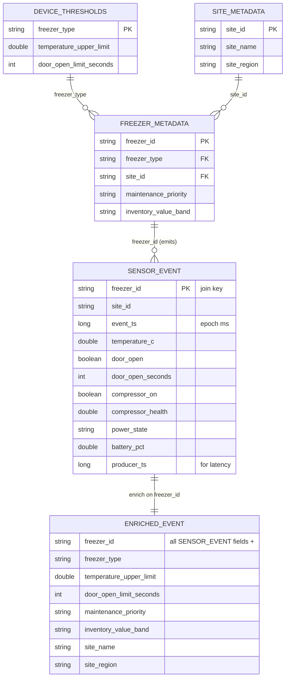

# Data model

How a reading becomes an enriched, analyzable record. The schemas live in
[`shared/schemas.py`](../shared/schemas.py); the join in
[`shared/enrichment.py`](../shared/enrichment.py); the reference data in
[`data/static/`](../data/static). Timestamps are **epoch milliseconds** (`long`) so
latency math stays unit-safe.

## Stages

```
1. Sensor event            2. Static reference          3. Enriched event
   (freezer_sensor_events)     (3 CSVs → "fleet")           (event ⋈ fleet on freezer_id)
        │                          │                              │
        └──────────────┬───────────┘                              ▼
                       └───────────────────────────────►  4. Alert record
                          business_logic + latency stamp      (freezer_alerts_enriched — Kafka, only sink)
```

## Entity relationships



## 1. Sensor event — `EVENT_SCHEMA`

The JSON payload the producer publishes to Kafka `freezer_sensor_events`.

| field | type | req | example | meaning |
|---|---|---|---|---|
| `event_id` | string | ✓ | `d4f1…` | unique per reading (uuid) |
| `event_ts` | long (ms) | ✓ | `1758045123456` | event time |
| `device_id` | string | ✓ | `FZ-0142-01` | sensor/device (= `freezer_id` here) |
| `freezer_id` | string | ✓ | `FZ-0142-01` | **join key** to the fleet |
| `site_id` | string | ✓ | `S0142` | store the unit is in |
| `temperature_c` | double | ✓ | `-18.2` | current temperature °C |
| `humidity_pct` | double | | `42.0` | relative humidity |
| `door_open` | boolean | ✓ | `false` | door state |
| `door_open_seconds` | int | ✓ | `0` | how long the door has been open |
| `compressor_on` | boolean | ✓ | `true` | compressor running |
| `compressor_health` | double | ✓ | `0.95` | 0–1 health score |
| `power_state` | string | ✓ | `normal` | `normal` \| `battery` \| `outage` |
| `battery_pct` | double | ✓ | `100.0` | backup battery |
| `ambient_temp_c` | double | | `22.5` | surrounding temperature |
| `defrost_cycle_active` | boolean | | `false` | in a defrost cycle |
| `scenario_name` | string | ✓ | `normal` | demo scenario that generated it |
| `synthetic_severity` | string | | `none` | producer's ground-truth label (`none`/`elevated`) |
| `producer_ts` | long (ms) | ✓ | `1758045123456` | creation time — start of the latency clock |

## 2. Static reference — three CSVs → one "fleet" table

`load_fleet()` reads three CSVs and joins them into a single table keyed by
`freezer_id`. It's both the enrichment side of the join **and** the pool the producer
draws freezers from.

**`freezer_metadata.csv`** — one row per freezer (PK `freezer_id`)

| column | type | example | notes |
|---|---|---|---|
| `freezer_id` | string | `FZ-0142-01` | primary key |
| `freezer_type` | string | `walk_in_freezer` | → `device_thresholds` |
| `site_id` | string | `S0142` | → `site_metadata` |
| `maintenance_priority` | string | `high` | `low`/`medium`/`high` |
| `inventory_value_band` | string | `high` | `low`/`medium`/`high` |

**`device_thresholds.csv`** — one row per freezer *type* (PK `freezer_type`)

| column | type | example | notes |
|---|---|---|---|
| `freezer_type` | string | `walk_in_freezer` | primary key |
| `temperature_upper_limit` | double | `-15.0` | the alerting threshold (°C) |
| `door_open_limit_seconds` | int | `180` | door-open alerting threshold |

**`site_metadata.csv`** — one row per store (PK `site_id`)

| column | type | example |
|---|---|---|
| `site_id` | string | `S0142` |
| `site_name` | string | `Store 0142 Austin` |
| `site_region` | string | `TX` |

`load_fleet` = `freezer_metadata ⋈ device_thresholds (freezer_type) ⋈ site_metadata (site_id)`.

## 3. The enrichment join

`enrich(events, fleet)` does a **broadcast stream-static left join** on `freezer_id`
(RTM-supported). The static side is small, so it's broadcast to every task; the event
stream keeps its own `site_id`, and only these columns are pulled in:

```
freezer_type, temperature_upper_limit, door_open_limit_seconds,
maintenance_priority, inventory_value_band, site_name, site_region
```

## 4. Enriched event — `enriched_schema()`

`EVENT_SCHEMA` + `ENRICHMENT_SCHEMA` — every sensor field plus the seven enrichment
columns above. This is exactly the input `rules.business_logic` expects: it now has both
the live reading **and** the per-unit thresholds/context to judge it (e.g. compare
`temperature_c` against `temperature_upper_limit`, `door_open_seconds` against
`door_open_limit_seconds`, and weigh `inventory_value_band` / `maintenance_priority`).

## Next stage — the alert record (`ALERT_OUTPUT_COLUMNS`)

Downstream of enrichment, the alerting logic adds `alert_type` / `alert_severity` /
`alert_reason` (plus the incident columns — see below) and keeps only rows that raised an
alert; `latency_utils.add_latency_fields` then adds `source_mode`, `processing_start_ts`,
`alert_emit_ts`, `end_to_end_latency_ms`, and `within_250ms` / `within_1s` / `within_5s`.
That record is written to Kafka `freezer_alerts_enriched` — the only sink; the app tails
it. In the demo the logic runs as the **stateful incident engine**
([`docs/alerting-logic.md`](./alerting-logic.md)), which also adds `incident_id` /
`lifecycle_event` / `incident_started_ts` / `escalation_level` / `peak_temp_c` /
`temp_trend`; [`shared/rules.py`](../shared/rules.py) is the equivalent stateless reference.
```
event (raw)  ──enrich──►  enriched event  ──business_logic──►  + alert_type/severity/reason
                                            ──add_latency_fields──►  + source_mode/timing/within_*
```
